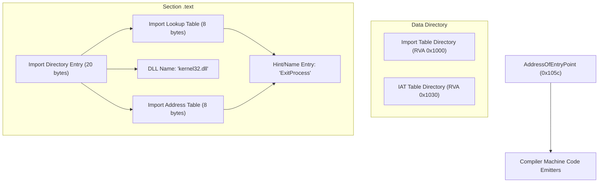

# Netiv Lang As-Built Architecture

This document records the actual architectural layout and system capabilities of the Netiv toolchain, including the newly implemented **Host-Less Native PE DLL Imports**.

---

## 1. Directory Structure

* **`src/`**: All standard, canonical library pages and compiler components.
* **`docs/`**: Reference guides, active Backlog/Todo tracking, and as-built architectural designs.
* **`bin/`**: Compiled output binaries and platform executables.
* **`build/`**: Diagnostic manifests and intermediate compilation hosts.
* **`db/`**: SQLite semantic compiler registry databases.
* **`logs/`**: Visual dependency files, file lists, and scanned json metadata.

---

## 2. Host-Less Native PE DLL Imports

The native compiler's PE builder (`EMIT_PE` inside [src/compiler.ntv](file:///c:/Projects/Netiv%20Lang/src/compiler.ntv)) has been extended to support **Import Address Table (IAT)** generation. Standalone compiled Netiv executables can now import standard Windows DLL APIs (starting with `kernel32.dll`) without a C# host process!

### Layout of the Generated PE Import Directory

### Technical Byte Specifications (Offset Mapping)

When `EMIT_PE` compiles the `.text` segment:
1. **0x1000** (RVA offset 0): **Import Directory Entry** pointing to ILT (`0x1028`), DLL Name (`0x1040`), and IAT (`0x1030`).
2. **0x1014**: **Null Import Directory Entry** (20 bytes of zeros).
3. **0x1028**: **Import Lookup Table (ILT)** pointing to the Hint/Name entry (`0x104d`).
4. **0x1030**: **Import Address Table (IAT)** which the Windows Loader overwrites with the actual memory address of `ExitProcess`.
5. **0x1040**: DLL Name String (`"kernel32.dll\0"`).
6. **0x104d**: Hint/Name Entry (`Hint: 0x0000`, `"ExitProcess\0"`).
7. **0x105c**: **AddressOfEntryPoint** (the first instruction of compiled code starts immediately after the Import structures!).

---

## 3. The Path to 100% C#-Free Self-Hosting

Now that the PE import table generation is integrated, the remaining self-hosting steps are:

* **Step 2 (Next)**: Write a native Netiv script `src/cli.ntv` replacing `netiv_launcher.cs` to handle command routing, package manifests, and SQLite crawling using `std.io` and standard Windows imports.
* **Step 3**: Compile `src/cli.ntv` natively with `EMIT_PE` into the host-less executable `bin/netiv.exe`.
* **Step 4**: Permanently delete all C# `.cs` files and PowerShell `.ps1` scripts!
